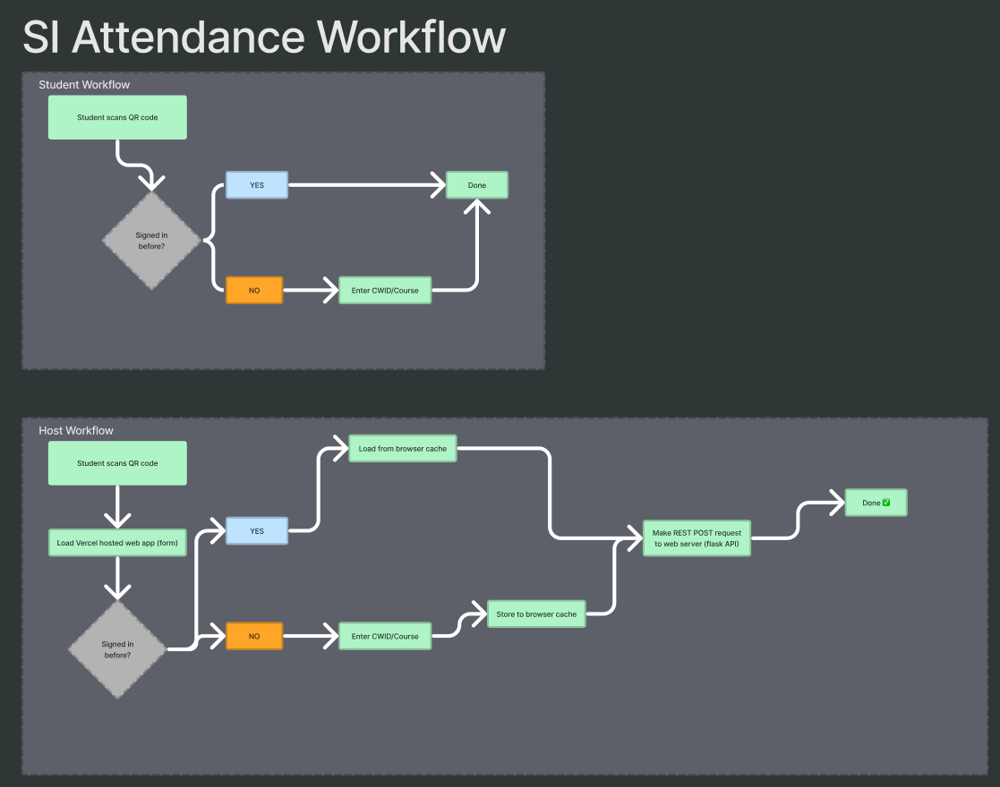

### SI Attendance Web Server

This api enables students attending SI sessions (at CSUF) to more easily log their attendance.

##### Simplified Workflow Diagram



##### Massive thanks to Aaron Lieberman (HTTP/REST guru)

### Contributing

1. Spin up local dev server

```sh
export FLASK_APP=index.py && python -m flask run
```

2. Make Changes

3. `vercel deploy` # generate preview

4. `vercel --prod` # push to production
